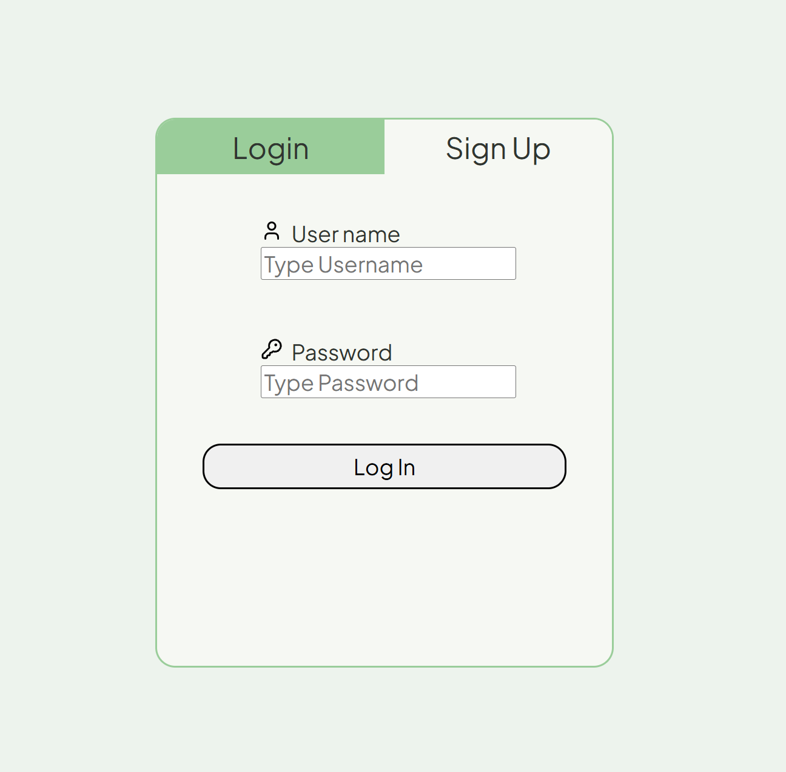
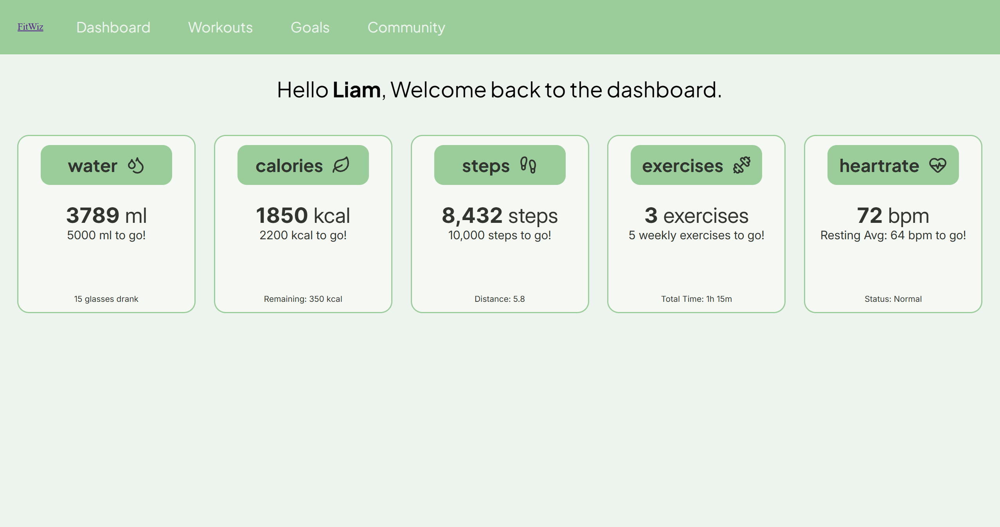
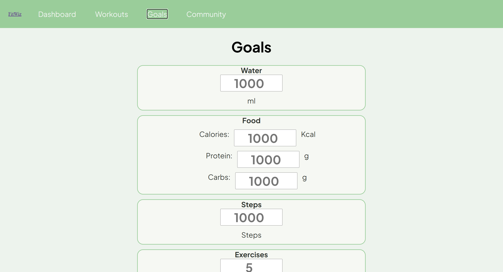
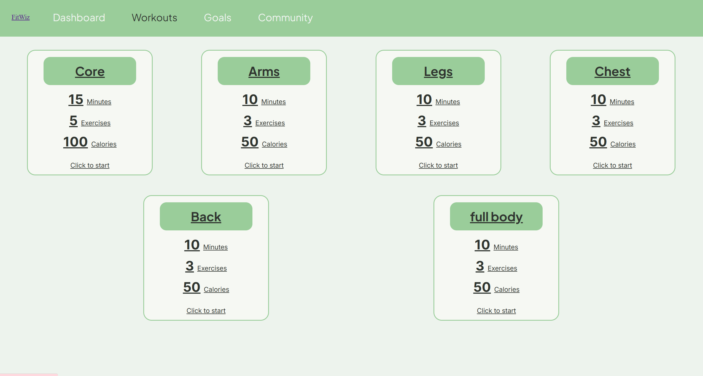
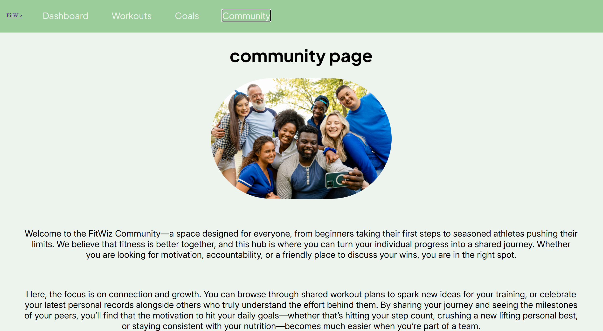

# FullStack Fitness App

## FitWiz
A comprehensive fitness management application designed to bridge the gap between workout planning and performance tracking. Whether you are a beginner looking for a structured plan or an athlete monitoring daily metrics, this app provides the tools to stay consistent and hit your personal bests.

## Key Features
<b>Daily Stats Dashboard:</b> Log and visualize your daily progress, from hydration to active calories.

<b>Workout Library:</b> Access a curated collection of exercise plans tailored to your goals.

<b>Goal Setting:</b> Define custom milestones and track your journey with intuitive progress markers.

<b>Responsive Design:</b> A seamless experience across mobile and desktop devices.

# Pages
Login Screen

Dashboard

Goals

Workouts

Community

